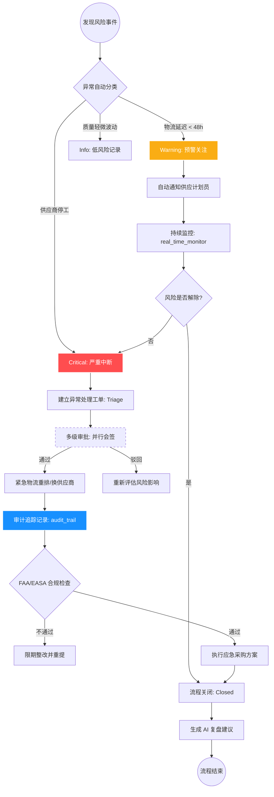

# 供应链风险处理结构化流程图 (Supply Chain Risk Workflow)

**场景定位**：针对航空供应链中的核心物料断供或延迟，定义的标准应急响应与处理流程。

---

## Mermaid 流程图 (机器可读)

---

## 关键节点定义 (Key Decision Nodes)

### 1. 风险分类 (Detect & Triage)
- **触发条件**：基于 `real_time_monitor` 模式中的 `critical` 状态。
- **决策规则**：若受影响物料涉及“关键飞行安全件”，默认升格为 `Critical` 等级。

### 2. 多级审批 (Multi-Level Approval)
- **合规卡点**：航空制造合同变更必须由质量部 (Quality) 与 合规部 (Compliance) 同时并行会签，不可由采购部单方决定。
- **关联模式**：`patterns/multi_level_approval.yml`。

### 3. FAA/EASA 合规检查 (Compliance Check)
- **硬性约束**：所有更换供应商的操作必须符合现行适航指令 (AD) 库。若新供应商不具备对应资质，流程强制阻断。

### 4. 异常处理记录 (Audit & Report)
- **落地要求**：处理过程中的所有对话、决策附件、时间点必须写入 `ux_spec.dev_handoff.tracking_requirements_zh`，确保事故后可一键追溯。

---

## AI 调用建议 (AI Usage)

- **查询**：当 AI 被问及“如何处理供应商突然停产”时，应提取本流程中的 `Critical -> Triage -> MultiApproval` 路径进行建议。
- **自动化**：当环境支持时，AI 可依据本 Markdown 自动解析流程逻辑，并为用户生成对应的 `ux_spec` 任务流部分。
